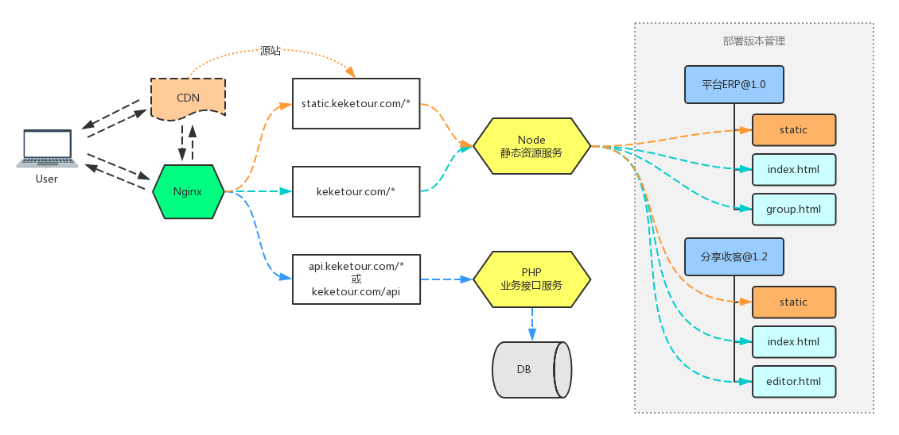
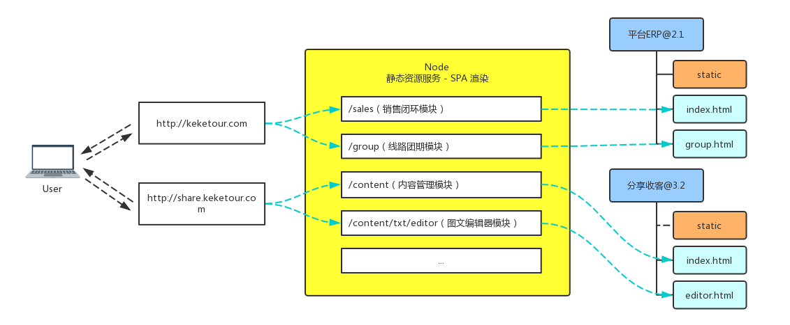

# kkt-static-server

> 可可兔前端静态资源服务 

# 警告
* master分支只适合Docker用， 不用Docker 请发布 dev 分支

# 简介
为了解决前端项目独立部署的问题，该服务主要提供以下功能：

* 静态资源部署、访问
* htaccess 路由重写（仿apache服务器的.htaccess功能，实现 SPA 路由映射）
* 静态资源发布版本管理（待定）

### 静态资源服务访问流程



### SPA渲染访问流程



# 安装
```
$ git clone http://git.keketour.com:3000/FE-Services/kkt-static-server.git
```

# 使用

## 启动
```
$ cd kkt-static-server
$ npm run start                     // 默认启动端口 5000

$ npm run start -- --port=3000      // 自定义启动端口
```

## 停止
```
$ cd kkt-static-server
$ npm run stop
```

## 访问
启动后即可通过端口访问，假如启动 kkt-static-server 服务的机器IP为 192.168.1.100
```
$ curl http://192.168.1.100:5000/resources/静态资源挂载节点
```

# 部署静态资源

## 部署前端代码

### 部署文件结构

例如我们要把以下几个项目部署到线上

* platform-web：平台ERP PC 端
* platform-app：平台ERP 移动端
* share-web：分享收客 PC 端
* share-app：分享收客 移动端

每个项目下的 dist 静态资源目录结构如下：

```
  dist
    |__static
    |   |__js
    |   |__css
    |   |__img
    |__index.html
    |__user.html
    |__login.html
    |__group.html
    |__lineEditor.html
    |__htaccess.json
```

### 编写 htaccess.json 配置

platform-web/dist/htaccess.json
``` javascript
{
    "root": "/platform/",                   // 挂载节点
    "rewrites": {                           // 路由重写
        "/": "/index.html",
        "/user": "/user.html",
        "/user/login": "/login.html",
        "/group": "/group.html",
        "/group/line/editor": "/lineEditor.html"
    }
}
```

platform-app/dist/htaccess.json
``` javascript
{
    "root": "/platform/app/",               // 挂载节点
    "rewrites": {                           // 路由重写
        "/": "/index.html",
        "/home": "/home.html",
        "/user/login": "/login.html"
    }
}
```

### 部署

``` sh
# 部署平台ERP PC 端
$ scp -r ./platform-web/dist/ root@192.168.1.100:/var/www/kkt-static-server/public/platform-web/
# 部署平台ERP移动端
$ scp -r ./platform-app/dist/ root@192.168.1.100:/var/www/kkt-static-server/public/platform-app/
# 部署分享收客 PC 端
$ scp -r ./share-web/dist/ root@192.168.1.100:/var/www/kkt-static-server/public/share-web/
# 部署分享收客移动端
$ scp -r ./share-app/dist/ root@192.168.1.100:/var/www/kkt-static-server/public/share-app/
```

## 配置 Nginx

### 作为 SPA 渲染服务

配置平台ERP PC 端
``` sh
server {
    server_name keketour.com;

    location ^~ / {
        # /resources/ 后面为 htaccess.json 中的挂载节点字段 root
        proxy_pass      http://192.168.1.100:5000/resources/platform/;
    }
}
```

配置平台ERP移动端
``` sh
server {
    server_name m.keketour.com;

    location ^~ / {
        proxy_pass      http://192.168.1.100:5000/resources/platform/app/;
    }
}
```

配置分享收客 PC 和移动端
``` sh
server {
    server_name share.keketour.com;

    location ^~ / {
        proxy_pass      http://192.168.1.100:5000/resources/share/;
    }

    # 使用目录挂载
    location ^~ /app/ {
        proxy_pass      http://192.168.1.100:5000/resources/share/app/;
    }
}
```

配置好后即可通过绑定的域名访问 htaccess.json 中配置的 SPA

``` sh
# 平台ERP PC 端
$ curl http://keketour.com/
$ curl http://keketour.com/user
$ curl http://keketour.com/user/login
$ curl http://keketour.com/group
$ curl http://keketour.com/group/line/editor
# 平台ERP移动端
$ curl http://m.keketour.com/
$ curl http://m.keketour.com/home
$ curl http://m.keketour.com/user/login
# 分享收客 PC 端
$ curl http://share.keketour.com/
$ curl http://share.keketour.com/home
# 分享收客移动端
$ curl http://share.keketour.com/app
$ curl http://share.keketour.com/app/user/login
```

### 作为静态资源服务

``` sh
server {
    server_name static.keketour.com;

    location ^~ / {
        proxy_pass      http://192.168.1.100:5000/resources/;
    }
}
```

配置好后即可通过 static.keketour.com 域名访问对应的系统静态资源

``` sh
# 平台ERP PC 端
$ curl http://static.keketour.com/platform/static/js/app.js
$ curl http://static.keketour.com/platform/static/css/app.css
$ curl http://static.keketour.com/platform/static/img/logo.png
# 平台ERP移动端
$ curl http://static.keketour.com/platform/app/static/js/app.js
$ curl http://static.keketour.com/platform/app/static/css/app.css
$ curl http://static.keketour.com/platform/app/static/img/logo.png
# 分享收客 PC 端
$ curl http://static.keketour.com/share/static/js/app.js
$ curl http://static.keketour.com/share/static/css/app.css
$ curl http://static.keketour.com/share/static/img/logo.png
# 分享收客移动端
$ curl http://static.keketour.com/share/app/static/js/app.js
$ curl http://static.keketour.com/share/app/static/css/app.css
$ curl http://static.keketour.com/share/app/static/img/logo.png
```

# 参考文档

[《前端构建/打包/独立部署方案》](https://www.processon.com/view/link/596b6d77e4b064b2bffce4ba)


# Docker
```
docker build -t staticserver:v1.0.0 .

docker pull [你的镜像]

sudo mkdir -p /var/lib/kkt-static-public

docker run -d --name=staticserver -p 5000:5000 -v /var/www/kkt-static-public:/kkt-static-server/public staticserver:v1.0.0
```
